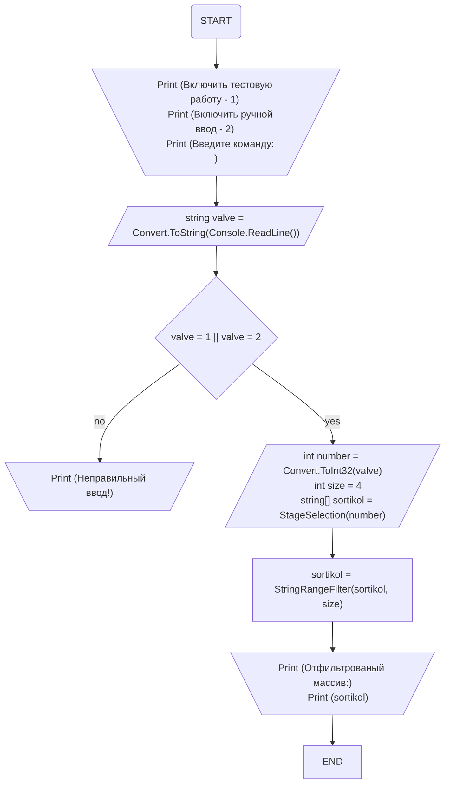

```mermaid
graph TD;
    A("START")-->B[\"Print (Включить тестовую работу - 1) 
    Print (Включить ручной ввод - 2) 
    Print (Введите команду: )"/]

    B-->C[/"string valve = Convert.ToString(Console.ReadLine())" /]

    C-->D{"valve = 1 || valve = 2"}

    D--"no"-->E[\" Print (Неправильный ввод!)"/]

    D--"yes"-->F[/"int number = Convert.ToInt32(valve)
    int size = 4
    string[] sortikol = StageSelection(number)"/]

    F-->I["sortikol = StringRangeFilter(sortikol, size)"]

    I-->G[\"Print (Отфильтрованый массив:)
    Print (sortikol)"/]

    G-->L["END"]
```    